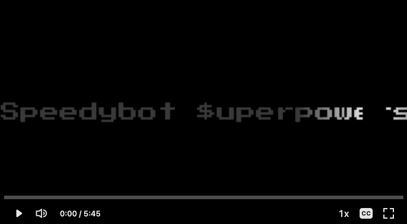
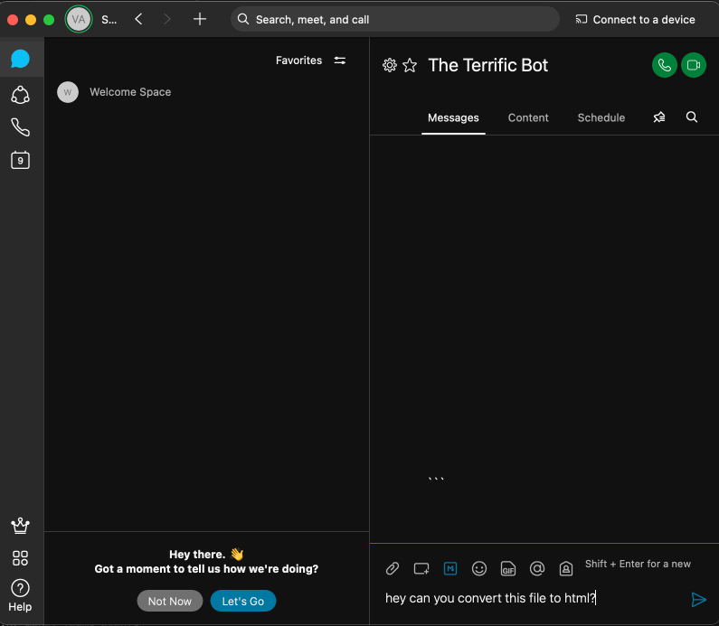
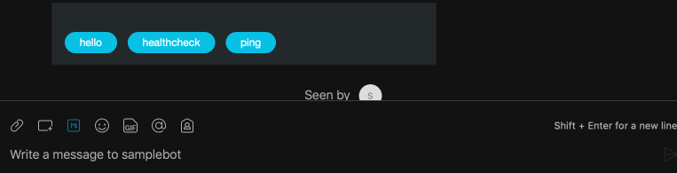

## Speedybot-superpowers

---

**Note:** To jump right in, go here: **[quickstart.md](./quickstart.md)**


[](https://share.descript.com/view/sBU3pk5L8Js)

---


This repo uses various "$uperpowers" to add response variation, interact with files and perform data transformations. You could use this as a starting point to integrate with a 3rd-party services.

The **<@fileupload>** handler in this repo is able to convert xlsx files to html using **[sheetjs](https://www.npmjs.com/package/xlsx)**. 

Any of phrase which matches 'convert' will activate the conversion feature:

ex. 
```
Convert this spreadsheet to html
Can you convert this file?
convert
```

When the conversion feature is not enabled, the user can upload json/txt/csv files, access their contents and echo back to the user.




## Setup

```sh
git clone https://github.com/valgaze/speedybot-superpowers
cd speedybot-superpowers
npm run setup
# add your token to settings/config.json and launch with $ npm start
```

## "Chips" Example




## $uperpowers

You can use $uperpowers to add variation, rich responses, or handle different files.


```ts
import { $ } from 'speedybot'

export default 	{
    keyword: ['$', '$uperpowers', '$uperpower', '$superpower'],
    async handler(bot, trigger) {

        // ## 0) Wrap the bot object in $ to give it $uperpowers, ex $(bot)
        const $bot = $(bot)

        // ## 1) Contexts: set, remove, and list
        // Contexts persist between "turns" of chat
        // Note: contexts can optionally store data
        // If you just need to stash information attached to a user, see "$(bot).saveData" below
        await $bot.saveContext('mycontext1')
        await $bot.saveContext('mycontext2', { data: new Date().toISOString()})

        const mycontext2 = await $bot.getContext('mycontext2')
        $bot.log('# mycontext2', mycontext2) // { data: '2021-11-05T05:03:58.755Z'}

        // Contexts: list active contexts
        const allContexts = await $bot.getAllContexts() // ['mycontext1', 'mycontext2']
        bot.say(`Contexts: ${JSON.stringify(allContexts)}`)

        // Contexts: check if context is active
        const isActive = await $bot.contextActive('mycontext1')
        $bot.log(`mycontext1 is active, ${isActive}`) // 'mycontext1 is active, true'

        // Contexts: remove context
        await $bot.deleteContext('mycontext1')

        const isStillActive = await $bot.contextActive('mycontext1')
        $bot.log(`mycontext1 is active, ${isStillActive}`) // 'mycontext1 is active, false'

        // ## 2) Helpers to add variation and rich content

        // sendRandom: Sends a random string from a list
        $bot.sendRandom(['Hey!','Hello!!','Hiya!'])

        // sendTemplate: like sendRandom but replace $[variable_name] with a value
        const utterances = ['Hey how are you $[name]?', `$[name]! How's it going?`, '$[name]']
        const template = { name: 'Joey'}
        $bot.sendTemplate(utterances, template)

        // sendURL: Sends a URL in a clickable card
        $bot.sendURL('https://www.youtube.com/watch?v=3GwjfUFyY6M', 'Go Celebrate')

        // snippet: Generate a snippet that will render data in markdown-friendly format
        const JSONData = {a: 1, b:2, c:3, d:4}

        $bot.sendSnippet(JSONData, `**Here's some JSON, you'll love it**`) // send to room

        // Snippet to a specifc room or specific email
        // const snippet = $bot.snippet(JSONData)
        // $bot.send({markdown: snippet, roomId:trigger.message.roomId, text: 'Your client does not render markdown :('}) // send to a specific room
        // $bot.send({markdown: snippet, toPersonEmail:'joe@joe.com', text: 'Your client does not render markdown :('}) // send to a specific person


        // ## 3) Save data between conversation "runs"

        interface SpecialUserData {
            specialValue: string;
            userId: String;
        }
        const specialData:SpecialUserData = {
            specialValue: Math.random().toString(36).slice(2),
            userId: trigger.personId,
        }
        
        // Save the data
        await $bot.saveData<SpecialUserData>('userData', specialData)
        
        // Retrieve the data (returns null if does not exist)
        const dataRes = await $bot.getData<SpecialUserData>('userData')

        if (dataRes) {
            // These are now "typed"
            const theValue = dataRes.specialValue
            const id = dataRes.userId
            $bot.log(`Your specal value was ${theValue} and your id is ${id}`)

            // destroy data
            $bot.deleteData('userData')
        }

        // ## 4) Integrate with 3rd-parties: $bot.get, $bot.post, etc

        // ex. get external data
        // Opts are axios request config (for bearer tokens, proxies, unique config, etc)
        const res = await $bot.get('https://randomuser.me/api/')
        bot.say({markdown: $bot.snippet(res.data)})

        // ## 4) Files & attachments

        // Send a local file
        // Provide a path/filename, will be attached to message
        $bot.sendFile(__dirname, 'assets', 'speedybot.pdf')

        // Send a publically accessible URL file
        // Supported filetypes: ['doc', 'docx' , 'xls', 'xlsx', 'ppt', 'pptx', 'pdf', 'jpg', 'jpeg', 'bmp', 'gif', 'png']
        $bot.sendDataFromUrl('https://drive.google.com/uc?export=download&id=1VI4I4pYVVdMnB6YOQuSejVcrSwN0cotd')

        // // experimental (fileystem write): send arbitrary JSON back as a file
        // $bot.sendDataAsFile(JSON.stringify({a:1,b:2}), '.json')

        // For an example involving parse'able spreadsheets (.xlsx), see here: https://github.com/valgaze/speedybot-superpowers
    },
    helpText: 'A demo of $uperpowers'
}
```

| **Command** | **Desc** |
| --- | --- |
| ```npm run setup``` | Setup dependency and bundle |
| ```npm run dev``` | Start with live-reload on code-changes |
| ```npm run ui``` | Boot web-based debug panel | 
| ```npm start``` | Start chat agent |
| ```npm start:server``` | Start server (you'll need to set ```webhookUrl``` in settings/config.json) |


Get a **[new](https://developer.webex.com/my-apps/new/bot)** or **[existing](https://developer.webex.com/my-apps)** token and save to **[config.json](./settings/config.json)**


<details><summary>Information for booting with a server</summary>

To boot with a server, deploy it and append "/speedybotwebhook" to the address

```json
{
    "token":"aaa-bbb-ccc-ddd",
    "webhookUrl":"https://123-45-678-910-987.ngrok.io/speedybotwebhook"
}
```

Boot the server with:

```sh
npm run start:server
```

If you want to test webhooks without deploying, you can obtain a 2-hour tunnel for testing with the following command

```
npx speedybot tunnel <port_number>
```

With the tunnel address, use it under webhookUrl

</details>


Speedybot instruments on top of the incredibly useful **[webex-node-bot-framework](https://github.com/WebexSamples/webex-node-bot-framework)** and steps through the fastest path to a working bot and provides some convenience features

## Adding a new chat handler

With Speedybot, all you need to worry about is the **[settings directory](https://github.com/valgaze/speedybot/tree/master/settings)** directory with two files:

**1. config.json:** This is where you'll put your bot access token and the "tunnel" (or webhost) where your bot is reachable from webhooks

**2. handlers.ts:** A list of "handlers" that respond to keywords

Example handler:

```js
{
	keyword: ['hello', 'hey', 'yo', 'watsup', 'hola'],
	handler(bot, trigger) {
		// bot: https://github.com/WebexSamples/webex-node-bot-framework#bot
		// trigger: https://github.com/WebexSamples/webex-node-bot-framework#trigger
		const reply = `Heya how's it going ${trigger.person.displayName}?`
		bot.say(reply)
	},
	helpText: `**hello** A handler that greets the user`
}
```

## Special keywords

There are a few "special" keywords you can use to "listen" to special events:

- *<@submit>*: Handler that will run anytime data is submitted from an **[Adaptive Card](https://developer.webex.com/docs/api/guides/cards)**

- *<@catchall>*: Handler that will run on **every** message received (can be useful to dispatch messages to natural language services like **[DialogFlow](https://cloud.google.com/dialogflow)** or **[Lex](https://aws.amazon.com/lex/)**)

- *<@fileupload>*: Handler that will fire on **every** file-upload or file-attachment sent to the bot

- *<@help>*: There is a built-in help handler by default (it will print out all of your custom handler's helpTexts from settings/handlers.ts), but use this if you want to make your own

- *<@spawn>*: Gets called whenever a user adds your bot to a new space-- there are some caveats, however, to its behavior, so if you think you'll need this, see **[here](https://github.com/WebexSamples/webex-node-bot-framework/blob/master/README.md#spawn)**, **[here](https://developer.webex.com/blog/a-deeper-dive-into-the-webex-bot-framework-for-node-js)** or the **[resources page](https://github.com/valgaze/speedybot/blob/master/docs/resources.md)** for all the details

- *<@despawn>*: Opposite of spawn, see **[here](https://github.com/WebexSamples/webex-node-bot-framework/#despawn)** for details

ex. Tell the bot "sendcard" to get a card, type into the card & tap submit, catch submission using *<@submit>* and echo back to user

```ts
export default [{
        keyword: '<@submit>',
        handler(bot, trigger) {
            bot.say(`Submission received! You sent us ${JSON.stringify(trigger.attachmentAction.inputs)}`)
        },
        helpText: 'Special handler that fires when data is submitted'
    },
    {
        keyword: 'sendcard',
        handler(bot, trigger) {
            bot.say('One card on the way...')

            // Adapative Card: https://developer.webex.com/docs/api/guides/cards
            const cardPayload = {
                "$schema": "http://adaptivecards.io/schemas/adaptive-card.json",
                "type": "AdaptiveCard",
                "version": "1.0",
                "body": [{
                    "type": "TextBlock",
                    "size": "Medium",
                    "weight": "Bolder",
                    "text": "System is 👍"
                }, {
                    "type": "RichTextBlock",
                    "inlines": [{
                        "type": "TextRun",
                        "text": "If you see this card, everything is working"
                    }]
                }, {
                    "type": "Image",
                    "url": "https://i.imgur.com/SW78JRd.jpg",
                    "horizontalAlignment": "Center",
                    "size": "large"
                }, {
                    "type": "Input.Text",
                    "id": "inputData",
                    "placeholder": "What's on your mind?"
                }],
                "actions": [{
                    "type": "Action.OpenUrl",
                    "title": "Take a moment to celebrate",
                    "url": "https://www.youtube.com/watch?v=3GwjfUFyY6M",
                    "style": "positive"
                }, {
                    "type": "Action.Submit",
                    "title": "Submit",
                    "data": {
                        "cardType": "inputForm"
                    }
                }]
            }

            bot.sendCard(cardPayload, 'Your client does not currently support Adaptive Cards')
        },
        helpText: 'Sends an Adaptive Card with an input field to the user'
    }
]
```

## Video Instructions

- 101: https://share.descript.com/view/ds3UA1kUb9z

- Webhooks/3rd-party integrations: https://share.descript.com/view/bnyupJvNJcx
