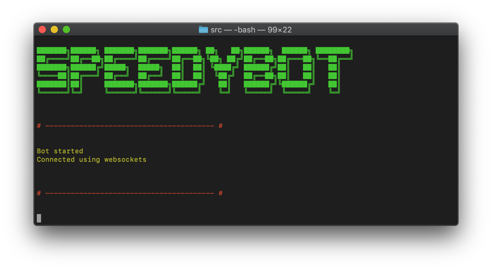

## Quickstart

Note: The steps below assume you have a working WebEx account & **[Nodejs](https://nodejs.org/en/download/)** 12+

Steps below can be automated using the cli, select the "speedybot-superpowers" option

```sh
npx speedyhelper setup
```


## 1. Fetch repo & install dependencies

```
git clone https://github.com/valgaze/speedybot-superpowers
cd speedybot-starter
npm run setup
```

## 2. Set your bot access token

- If you have an existing bot, get its token here: **[https://developer.webex.com/my-apps](https://developer.webex.com/my-apps)**

- If you don't have a bot, create one and save the token from here: **[https://developer.webex.com/my-apps/new/bot](https://developer.webex.com/my-apps/new/bot)**

Once you have the bot's token, save it to **[settings/config.json](./settings/config.json)** under the ```token``` field

## 3. Boot your Bot

```sh
npm start
```

If all went well, it should look something like this:


## 4. Run a "healthcheck" with the bot

To make sure all is well, add your bot from Step 1 in a 1-1 chat session and tell it "healthcheck"-- if everything is configured properly you should see something like this:



## 5. Ask it to convert a spreadsheet

- Ask the agent something like "hey convert this file to html"

- Once acknowledged, attach a spreadsheet *.xlsx and the system will return an HTML preview


Sample spreadsheet: **[./settings/assets/sample.xlsx](sample.xlsx)**

## 5. Extend

- Add more 3rd-party integrations-- take data from an uploaded & pass onto another service

- Use **[$uperpowers](https://github.com/valgaze/speedybot/blob/master/docs/superpowers.md)**